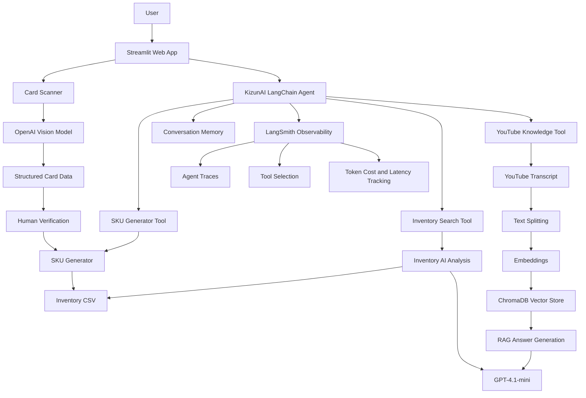
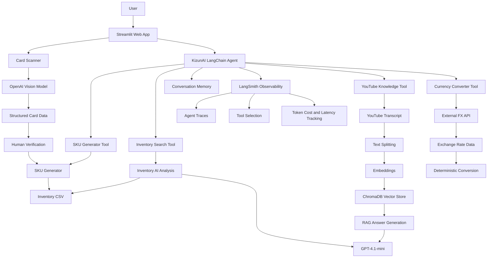

# KizunAI

### AI-Powered TCG Inventory Assistant

**Scan. Identify. Price. Vault.**

KizunAI is a multimodal AI assistant designed to automate inventory workflows for Trading Card Game businesses and collectors.

The project was developed as an AI Engineering final project and is based on a real operational challenge from **Umami Vault**, a Dubai-based TCG and collectibles business.

KizunAI combines multimodal vision, structured information extraction, human-in-the-loop verification, LangChain agents, conversational memory, Retrieval-Augmented Generation (RAG), ChromaDB and LangSmith observability in a deployed Streamlit application.

---

## The Problem

Cataloguing Trading Card Game inventory is repetitive and time-consuming.

For every card, a business may need to:

- Identify the product
- Identify the TCG
- Find the set or collection
- Find the card number
- Identify the language
- Determine rarity
- Record condition
- Identify whether the card is raw or graded
- Generate a unique SKU
- Enter cost and selling price
- Add the product to inventory

A manual workflow can take approximately **2 minutes per card**.

For an inventory of 1,000 cards, this represents more than **33 hours of repetitive operational work**.

---

## The Solution

KizunAI uses AI and deterministic business tools to reduce inventory entry time.

The user uploads an image of a trading card.

The system:

1. Analyzes the image using a multimodal OpenAI model.
2. Extracts structured card information.
3. Presents the extracted data for human verification.
4. Generates a deterministic SKU.
5. Saves the approved product to inventory.
6. Allows natural language inventory analysis.
7. Processes YouTube content using a RAG pipeline.
8. Uses a LangChain agent to select specialized tools.
9. Maintains conversational context for follow-up questions.
10. Uses external exchange-rate data for currency conversions.
11. Records AI execution traces with LangSmith.

The goal is to reduce inventory entry time from approximately **2 minutes per card to under 20 seconds per card**.

---

## Live Application

KizunAI is deployed as a Streamlit web application.

**Live App:**  
https://kizunai-umamivault.streamlit.app

---

## Core Features

### Multimodal Card Scanner

Users can upload an image of a trading card.

The scanner extracts structured information including:

- Product Name
- TCG
- Set Name
- Card Number
- Language
- Rarity
- Condition
- Raw or Slab
- Grade information when applicable

The scanner uses multimodal vision-based information extraction rather than a traditional custom-trained computer vision model.

---

### Human-in-the-Loop Verification

AI output is not automatically inserted into inventory.

The extracted card information is presented to the user for review and correction before approval.

This creates a human validation layer between AI extraction and inventory persistence.

The workflow is:

```text
Card Image
    ↓
Multimodal Vision Model
    ↓
Structured Card Data
    ↓
Human Verification
    ↓
SKU Generation
    ↓
Inventory
```

---

### Deterministic SKU Generator

KizunAI generates unique inventory SKUs using deterministic Python business logic.

The SKU generator processes:

- Product name
- Raw or graded status
- Grading company
- Grade
- Existing inventory counter

Example:

```text
Mario Pikachu
Raw
```

Generated SKU:

```text
MARPIKRAW001
```

Example:

```text
Charizard
PSA
10
```

Generated SKU:

```text
CHARIZARDPSA10-01
```

SKU generation intentionally does not use an LLM.

Because SKU creation follows deterministic business rules, standard Python logic provides more predictable and consistent results.

---

## KizunAI Agent

KizunAI includes a conversational AI agent built with LangChain.

The agent receives a natural language question and decides which specialized tool should be used.

The user does not manually select the internal AI pipeline.

The agent currently has access to four tools:

### 1. Inventory Search Tool

Used for questions about:

- Inventory
- Stock
- Quantities
- Costs
- Selling prices
- Profit
- Margins
- SKUs
- Collections

Example:

```text
How many Pikachu cards do I have?
```

The agent selects the Inventory Search Tool and analyzes the inventory data.

---

### 2. YouTube Knowledge Tool

Used for questions about a processed YouTube video.

Example:

```text
What cards does the creator recommend buying?
```

The agent routes the question to the YouTube RAG pipeline.

---

### 3. SKU Generator Tool

Used when the user asks to create or preview a SKU.

Example:

```text
Generate a SKU for a raw Mario Pikachu card.
```

The agent selects the SKU Generator Tool.

The tool executes deterministic Python SKU logic.

---

### 4. Currency Converter Tool

Used for currency conversion requests.

Example:

```text
How much is 5000 EUR in AED?
```

The agent selects the Currency Converter Tool.

The tool retrieves current reference exchange-rate data from an external FX API and performs the conversion using deterministic Python calculations.

The language model is explicitly instructed not to estimate currency conversions using model knowledge.

Example output:

```text
5,000 EUR = 20,983.50 AED

Exchange rate: 4.1967
Rate date: 2026-07-10
```

This provides grounded exchange-rate calculations instead of approximate LLM-generated answers.

---

## Agent Tool Selection

The agent dynamically selects the appropriate capability based on user intent.

```text
User Question
      ↓
KizunAI Agent
      ↓
LLM Tool Decision
      ↓
┌─────────────────────────────┐
│ Inventory Search            │
│ YouTube Knowledge           │
│ SKU Generator               │
│ Currency Converter          │
└─────────────────────────────┘
      ↓
Tool Execution
      ↓
Agent Final Response
```

This creates an agentic architecture where the language model performs orchestration while specialized tools execute domain-specific operations.

---

## Conversational Memory

KizunAI uses conversational memory to understand follow-up questions.

Example conversation:

```text
User:
How many Pikachu cards do I have?

KizunAI:
You have 4 Pikachu cards.

User:
Which one is the most expensive?

KizunAI:
The most expensive Pikachu is...

User:
What is its SKU?

KizunAI:
The SKU is...
```

The user does not need to repeat the full context in every question.

Conversation sessions are maintained using thread-based agent sessions and LangChain ConversationBufferMemory.

---

## YouTube RAG Pipeline

KizunAI includes a Retrieval-Augmented Generation pipeline for YouTube videos.

The user provides a YouTube URL.

The system processes the video transcript and creates a searchable knowledge base.

The pipeline is:

```text
YouTube Video
      ↓
Transcript Extraction
      ↓
Text Splitting
      ↓
Text Chunks
      ↓
Embeddings
      ↓
ChromaDB Vector Store
      ↓
Similarity Search
      ↓
Relevant Context
      ↓
LLM Answer Generation
```

When the user asks a question about the video, the system retrieves relevant transcript chunks before generating the answer.

This reduces reliance on the language model's internal knowledge and grounds the answer in the processed video content.

---

## Vector Database

KizunAI uses ChromaDB as the vector database for the YouTube RAG system.

Transcript chunks are converted into embeddings and stored in ChromaDB.

When a question is asked:

1. The question is embedded.
2. ChromaDB performs similarity search.
3. Relevant transcript chunks are retrieved.
4. Retrieved context is sent to the language model.
5. The model generates a grounded answer.

---

## LangSmith Observability

KizunAI uses LangSmith to trace and observe agent execution.

LangSmith allows inspection of:

- Agent execution
- Model calls
- Tool selection
- Nested AI operations
- Input and output
- Token usage
- Execution cost
- Latency

Example trace:

```text
AgentExecutor
      ↓
ChatOpenAI
      ↓
Inventory Search
      ↓
Inventory AI Analysis
      ↓
ChatOpenAI
      ↓
Final Answer
```

Another example:

```text
AgentExecutor
      ↓
ChatOpenAI
      ↓
Currency Converter
      ↓
ChatOpenAI
      ↓
Final Answer
```

LangSmith was also used to identify a real agent routing problem.

Initially, a currency conversion request was answered directly by the language model using an approximate exchange rate.

The answer appeared plausible but was not grounded in current exchange-rate data.

Using the LangSmith trace, the missing Currency Converter tool call was identified.

The agent instructions and tool description were improved to require currency conversion requests to use the specialized tool.

This changed the execution flow from:

```text
User
 ↓
LLM Estimate
 ↓
Approximate Answer
```

to:

```text
User
 ↓
Agent
 ↓
Currency Converter
 ↓
External FX Data
 ↓
Deterministic Calculation
 ↓
Grounded Answer
```

This demonstrates the importance of observability in agentic AI systems.

---

## System Architecture



---

## Technology Stack

### Frontend

- Streamlit

### Backend

- Python

### AI Models

- OpenAI multimodal models
- GPT-4.1-mini

### AI Framework

- LangChain

### AI Observability

- LangSmith

### Vector Database

- ChromaDB

### Data Processing

- Pandas

### Inventory Storage

- CSV for the MVP

### External Data

- External FX reference-rate API

### Deployment

- Streamlit Community Cloud

### Version Control

- Git
- GitHub

---

## Project Structure

```text
KizunAI/
│
├── app.py
│
├── pages/
│   ├── Agent_Chat.py
│   ├── dashboard.py
│   ├── Inventory_Search.py
│   └── Youtube_QA.py
│
├── services/
│   ├── agent.py
│   ├── scanner.py
│   ├── inventory_ai.py
│   ├── youtube_rag.py
│   ├── sku_generator.py
│   └── currency_converter.py
│
├── data/
│   └── inventory.csv
│
├── images/
│
├── requirements.txt
├── runtime.txt
├── .gitignore
└── README.md
```

---

## Installation

Clone the repository:

```bash
git clone https://github.com/hugoduartepenuela/KizunAI.git
```

Enter the project directory:

```bash
cd KizunAI
```

Create a virtual environment:

```bash
python -m venv .venv
```

Activate the virtual environment.

macOS or Linux:

```bash
source .venv/bin/activate
```

Windows:

```bash
.venv\Scripts\activate
```

Install dependencies:

```bash
pip install -r requirements.txt
```

---

## Environment Variables

Create a `.env` file in the project root.

Example:

```env
OPENAI_API_KEY=your_openai_api_key

LANGCHAIN_API_KEY=your_langsmith_api_key
LANGCHAIN_TRACING_V2=true
LANGCHAIN_PROJECT=KizunAI
```

Never commit API keys or the `.env` file to GitHub.

---

## Run Locally

Start the Streamlit application:

```bash
streamlit run app.py
```

---

## Business Impact

The project is based on a real inventory workflow from Umami Vault.

Estimated manual inventory entry time:

```text
Approximately 2 minutes per card
```

KizunAI target:

```text
Under 20 seconds per card
```

For 1,000 cards:

```text
Manual workflow:
~33.3 hours

KizunAI target:
~5.5 hours
```

Potential operational time saved:

```text
~27.8 hours per 1,000 cards
```

KizunAI demonstrates how multimodal AI and agentic systems can reduce repetitive operational work in a specialized collectibles business.

---

## Design Principles

KizunAI follows several core AI engineering principles.

### Use AI where reasoning is valuable

Multimodal card analysis, natural language inventory questions and agent tool selection benefit from AI reasoning.

### Use deterministic logic where consistency matters

SKU generation and currency calculations use standard Python logic.

### Ground answers in external or internal data

Inventory questions use inventory data.

YouTube questions use retrieved transcript context.

Currency conversions use external exchange-rate data.

### Keep humans in the validation loop

Card information is reviewed before being saved to inventory.

### Observe agent behavior

LangSmith traces are used to inspect model calls and tool decisions.

---

## Current Limitations

The current version is an MVP.

Known limitations include:

- CSV-based inventory storage
- Single-user architecture
- Conversation memory is stored in application memory
- Card identification depends on visible image information
- No automatic market price history
- No direct Shopify inventory synchronization
- No eBay sold-comparable analysis
- Currency rates are reference rates rather than trading execution prices

---

## Roadmap

Future versions of KizunAI may include:

- Airtable or PostgreSQL inventory storage
- Persistent conversational memory
- eBay market intelligence
- Recent sold-comparable analysis
- Portfolio valuation dashboards
- Historical price charts
- Multi-currency inventory valuation
- Shopify synchronization
- Image storage linked to inventory SKUs
- PSA and grading-service integrations
- Support for sealed products
- Manga and collectible identification
- Multi-user authentication
- Advanced agent workflows

---

## Project Context

KizunAI was developed as an AI Engineering final project.

The project is based on a real operational need identified while managing inventory for Umami Vault, a Trading Card Game and collectibles business based in Dubai.

The objective was not to build a generic chatbot.

The objective was to combine AI Engineering concepts into a system that addresses a measurable business bottleneck.

---

## Author

**Hugo Duarte Peñuela**

AI Engineering Final Project

Dubai, United Arab Emirates

---

## KizunAI

**Scan. Identify. Price. Vault.**
